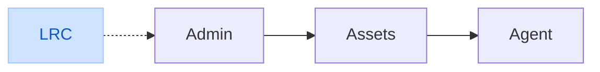

# PlayL - PlayList

## layout

## todos

### admin

- [x] 检查Lyrics内容格式
- [x] 创建Lyrics内容，同时更新索引
- [x] 更新Lyrics内容，同时更新索引
- [x] 更新Lyrics索引时，去掉Tag
- [x] 获取assets-lyrics的目录索引
- [x] 下载lyrics内容

### agent

- [x] 检索lyrics索引，根据关键词
- [x] 检索lyrics索引，根据字段
- [x] 获取assets-lyrics的目录索引
- [x] 下载lyrics内容
